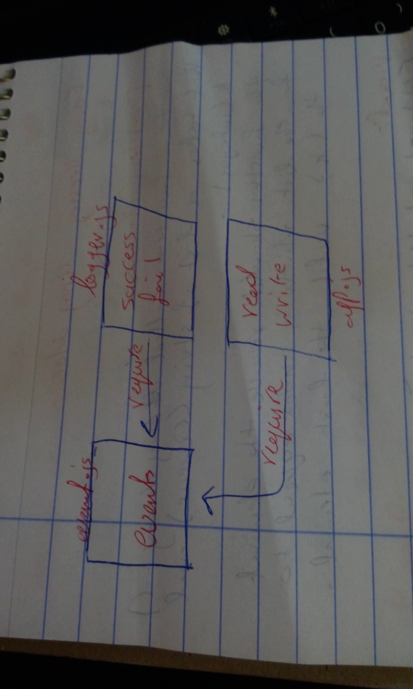

# LAB - Class 16

##  Event Driven Applications

### Author: Saja Swalgah

### Links and Resources

- [submission PR](https://github.com/Saja-401-advanced-javascript/class-16/pull/1)
- [github actions](https://github.com/Saja-401-advanced-javascript/class-16/actions/runs/43459179)

#### How to initialize/run your application (where applicable)

-`npm start` || `nodemon`
- npm run test

#### UML

